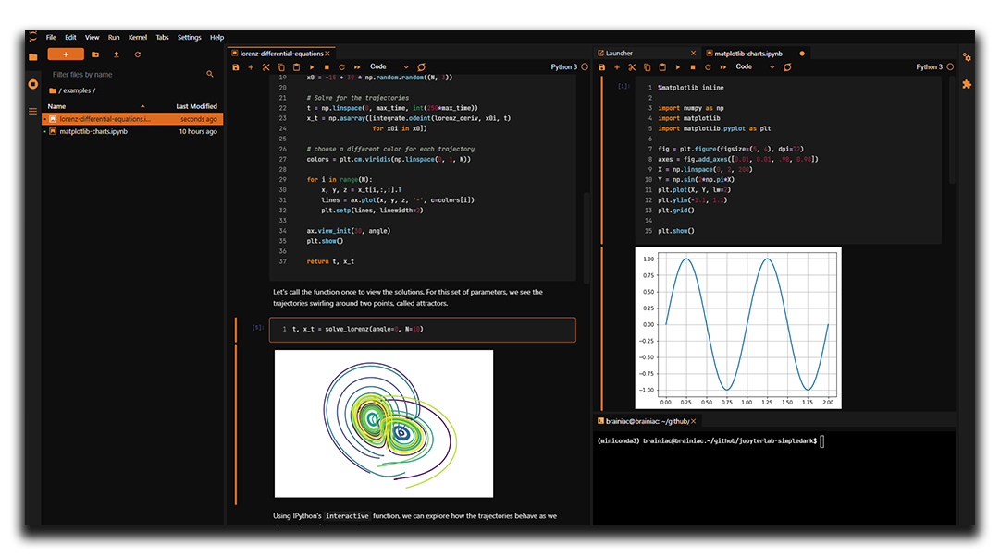
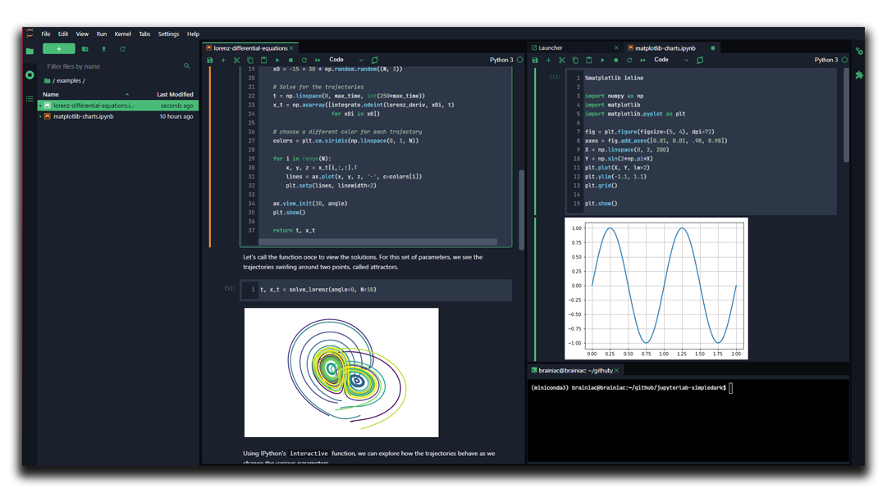
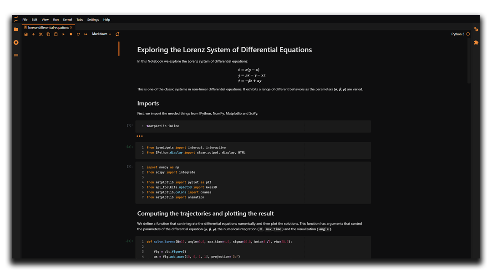

# Simpledark

[](https://badge.fury.io/py/jupyterlab-simpledark)

A (growing) dark theme collection for [JupyterLab](https://jupyter.org/).

Simpledark original          |  Simpledark fresh  (new :tada:)
:-------------------------:|:-------------------------:
  |  

## :wrench: Configurations

What about a nostalgic Jupyter Notebook layout? Set a cell max-width.

```settings``` -> ```advanced settings editor``` -> ```theme - Simpledark```

```json
{
    "maxCellWidth": "1024px"
}
```



## :warning: Requirements

* JupyterLab >= 3.0

## :cd: Install

The source code is currently hosted on GitHub at: https://github.com/ericmiguel/jupyterlab-simpledark.

Installers for the latest released version are available at the [PyPI](https://pypi.org/project/jupyterlab-simpledark).

```bash
pip install jupyterlab-simpledark
```

To uninstall, run:

```bash
pip uninstall jupyterlab-simpledark
```

## :hammer: Contributing

### Development install

For a development install, run the following commands in the repository directory:

```bash
npm install                   # install npm package dependencies
npm run build                 # optional build step if using TypeScript, babel, etc.
jupyter labextension install  # install the current directory as an extension
```

For incremental builds use:

```bash
jupyter lab --watch
```

To rebuild the package and the JupyterLab app:

```bash
npm run build
jupyter lab build
```

See also JupyterLab's documentation [Development workflow for source extensions](https://jupyterlab.readthedocs.io/en/stable/extension/extension_dev.html#development-workflow-for-source-extensions).

## :construction_worker: Maintainer

[](https://github.com/ericmiguel)

## :scroll: License

[MIT License](./LICENSE)